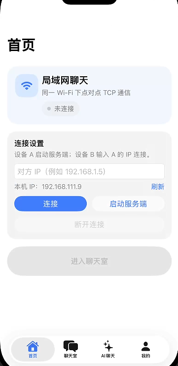
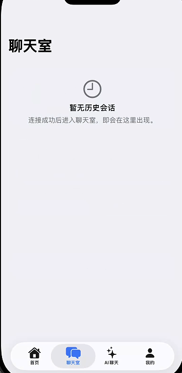
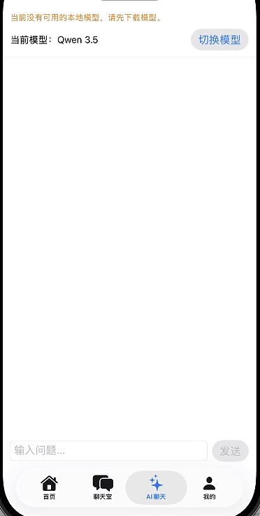
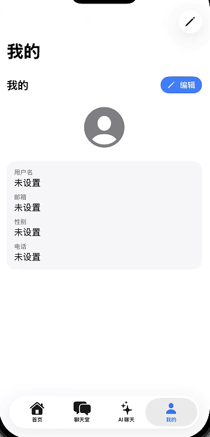

# ios-native-IM-ai

一个 iOS 原生的 **局域网 IM 聊天 +（可选）离线/本地 AI 问答** 示例项目（与 Android 侧产品能力对齐）。

> 说明：当前 iOS 端尚未开始编码。本 README 的定位是“复刻施工说明书”：你在 macOS 上用 vibecoding 复刻 Android 产品时，直接按这里的清单与约束落地即可。

## 界面展示

## 产品能力（与 Android 对齐）

- **局域网 IM**：同一 Wi‑Fi 下点对点 TCP 通信（设备 A 当服务端，设备 B 连接 IP）
- **即时聊天**：支持文本消息收发
- **连接状态**：连接中、已连接、断开、失败等状态反馈
- **心跳机制**：定时心跳，降低静默断连不可见问题
- **消息回执**：送达回执、已读回执（见 `docs/protocol.md`，`delivery_ack/read_ack`）
- **本地存储**：持久化聊天记录（iOS 可选 CoreData/SQLite 等）
- **个人资料**：昵称/头像等本地保存（具体字段可与 Android 对齐）
- **AI 聊天（可选）**：
  - 端侧离线问答（与 Android 的“模型不随包分发、首次下载”策略一致）
  - 或接入 PC AI 桥（把手机作为客户端连接 PC 端服务）

## 跨端协议（必须遵循）

实现任何网络互通前，请先阅读母仓协议文档（这是“跨端契约”，iOS 必须严格对齐字段与分帧方式）：

- `../../docs/protocol.md`

核心约定：**TCP + UTF-8 + 每行一条 JSON（newline 分隔）**。

## Android → iOS 复刻对照（建议按此拆任务）

Android 关键入口（用于对照复刻）：

- 根导航与页面切换：`apps/android/app/src/main/java/com/aiim/android/ui/chat/ChatScreen.kt`
- 主题与配色：`apps/android/app/src/main/java/com/aiim/android/ui/theme/Theme.kt`（配色在同目录文件）
- Socket 层：`apps/android/app/src/main/java/com/aiim/android/core/im/SocketManager.kt`
- 协议模型：`apps/android/app/src/main/java/com/aiim/android/data/remote/model/SocketMessage.kt`

建议 iOS（SwiftUI）对应拆分：

- `ConnectionScreen`（首页）：IP 输入、启动服务端、连接/断开、连接状态卡片、网络提示
- `ChatRoomsScreen`（聊天室列表）：历史会话列表、进入/删除
- `ChatRoomScreen`（聊天室）：消息列表、输入框、发送按钮、消息状态（sent/delivered/read/failed）
- `AiChatScreen`（AI 聊天）：先做“连接 PC AI 桥”互通，再补端侧离线模型（如需要）
- `ProfileScreen`（我的）：概览/编辑两态、头像选择、用户名/邮箱/性别/电话、本地保存；并把昵称同步到 Socket sender

## 开发环境（建议）

- Xcode（建议最新稳定版）
- iOS 目标版本按团队规划（建议与 UI/网络能力需求匹配）

## iOS 平台必备配置（局域网通信常见坑）

为确保 iOS 能在局域网内 TCP 通信与发现对端，请在工程落地时检查：

- **Local Network 权限**：iOS 14+ 需要声明并触发授权，否则局域网连接可能失败
  - `Info.plist` 添加 `NSLocalNetworkUsageDescription`
- **App Transport Security (ATS)**：本项目走 TCP，不是 HTTP；一般不需要为 ATS 开口子，但如果你后续加 HTTP 下载/接口，再按需配置
- **后台/锁屏行为**：若需要在后台维持连接，需要额外的 iOS 策略（建议先不做，先对齐前台体验）

## 迁移落地建议（最小可行路径）

1. **先完成协议与 Socket 层（第一优先）**
   - 连接/断开、收发“JSON 行”、心跳、连接状态管理
   - 先确保：iOS <-> Android 能互发 `text`；iOS <-> PC AI 桥能收到 AI 回复
2. **再完成 UI 主流程（高一致复刻）**
   - 底部四 Tab + ChatRoom 全屏子流程（进入聊天室时隐藏底栏）
   - 消息列表与输入栏的间距/圆角/颜色尽量贴近 Android
3. **补齐回执与状态**
   - `delivery_ack`：按 message id 更新送达
   - `read_ack`：按锚点 id 更新已读范围
4. **最后做 AI（按需求）**
   - 优先：接 PC AI 桥（最快与 Android 对齐“能聊 AI”）
   - 再做：端侧离线模型下载/管理/推理（投入较大）